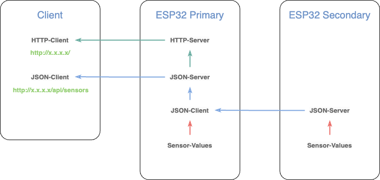

# ESP32 Wetterstation

## Table of Contents

[1. Features](#1-features) \
[2. Hardware](#2-hardware) \
[3. Installation](#3-installation) \
[4. Pinsetting](#4-pinsetting) \
[5. References](#5-references) \
[6. License](#6-license) \
[7. Changelog](#7-changelog)

<!--- --------------------------------------------------------------------- -->

## 1. Features

### Server / Client structure



### Webservices

|                |                                  |
| -------------- | -------------------------------- |
| ASyncWebserver | <http://192.168.1.1/>            |
| Update OTA     | <http://192.168.1.1/update>      |
| JSON Server    | <http://192.168.1.1/api/sensors> |

<!--- --------------------------------------------------------------------- -->

### Sky Quality Meter (SQM)

- Istil et al. “Night Sky Photometry with Sky Quality Meter.” (2005).

see details in [How to calibrate the SQI](doc/Calibrate_SQI.md)

<!--- --------------------------------------------------------------------- -->

### Air Quality Index (AQI)

- <https://document.airnow.gov/technical-assistance-document-for-the-reporting-of-daily-air-quailty.pdf>

- <https://www.airnow.gov/sites/default/files/2020-05/aqi-technical-assistance-document-sept2018.pdf>

### PM₂.₅ / PM₁₀ (µg/m³) AQI Breakpoints

| **AQI Range** | **PM₂.₅ (µg/m³)** | **AQI Range** | **PM₁₀ (µg/m³)** |
| ------------: | ----------------: | ------------: | ---------------: |
|        0 - 50 |        0.0 - 12.0 |        0 - 50 |           0 - 54 |
|      51 - 100 |       12.1 - 35.4 |      51 - 100 |         55 - 154 |
|     101 - 150 |       35.5 - 55.4 |     101 - 150 |        155 - 254 |
|     151 - 200 |      55.5 - 150.4 |     151 - 200 |        255 - 354 |
|     201 - 300 |     150.5 - 250.4 |     201 - 300 |        355 - 424 |
|     301 - 400 |     250.5 - 350.4 |     301 - 400 |        425 - 504 |
|     401 - 500 |     350.5 - 500.4 |     401 - 500 |        505 - 604 |

### Dewpoint Calculation

- <https://en.wikipedia.org/wiki/Dew_point>

$$\gamma (T,\mathrm {RH} ) = \ln \left({\frac {\mathrm {RH} }{100}}\right)+{\frac {bT}{c+T}} $$
$$T\_{\mathrm {d} } = {\frac {c\gamma (T,\mathrm {RH} )}{b-\gamma (T,\mathrm {RH} )}} $$
$$b = 17.625 $$
$$c = 243.04°C $$

<br><a href="#esp32-wetterstation"></a>

<!--- --------------------------------------------------------------------- -->

## 2. Hardware

### Sensors

#### ADS1015 (i2c)

- 4 port 12 bit AD converter

#### BME680 (i2c)

Enviroment sensor

- Temperature
- Humidity
- Pressure
- CO2

#### HM330X (i2c)

Laser dust detection sensor

- PM1
- PM25
- PM10

#### Davis Instruments Wind Sensor 6410 (d0, a3)

Wind direction vane, wind speed sensor

- Wind speed: Reed sensor based rotation encoder
- Wind direction: 20 k&Omega; potentiomete

#### Modern Devices Wind Sensor Ref.B (a0, a1)

Aneometer

- Wind speed
- Temperature

#### MLX90614 (i2c)

Infrared thermopile temperture sensor

- Ambiente temperature
- Object temperature

#### RG 11 (d2)

Optical Rain Gauge -> https://rainsensors.com/products/rg-11/

-

#### RS 12 (d3)

Rain sensor

-

#### SCD41 (i2c)

Photoacoustic NDIR senso

- CO2
- Temperature
- Humidity

#### TSL2591 (i2c)

High dynamic range digital light sensor

- VIS
- NIR

<br><a href="#esp32-wetterstation"></a>

<!--- --------------------------------------------------------------------- -->

## 3. Installation

- VSCode
- PlatformIO Plugin

#### Modification:

After installing the libraries change in

_.pio/build/seeed_xiao_esp32s3/ElegantOTA/src/ElegantOTA.h_

0 to 1

```html
# ifndef ELEGANTOTA_USE_ASYNC_WEBSERVER #define ELEGANTOTA_USE_ASYNC_WEBSERVER 1
# endif
```

#### Should be created

```c
/* mysecrets.h */
# ifndef MYSECRETS_H
# define MYSECRETS_H

// WiFi credentials
const char *ssid = "xxx";
const char *password = "xxx";

// HTTP credentials
const char *http_username = "xxx";
const char *http_password = "xxx";

# endif
```

<br><a href="#esp32-wetterstation"></a>

<!--- --------------------------------------------------------------------- -->

## 4. Pinsetting


#### ESP32

<code style="color :#69ADFF">**D1**</code> -> Interrupt input (Davis Instruments Wind Sensor 6410)

<code style="color :#69ADFF">**D2**</code> -> Interrupt input (RG 11)

<code style="color :#69ADFF">**D3**</code> -> Interrupt input (RS 12)

<code style="color :#69ADFF">**D4**</code> -> SDA (I2C)

<code style="color :#69ADFF">**D5**</code> -> SCL (I2C)

#### AD1015

<code style="color :#9ECE6A">**AI0**</code> -> Modern Devices temperature

<code style="color :#9ECE6A">**AI1**</code> ->

<code style="color :#9ECE6A">**AI2**</code> -> Modern Devices wind sensor

<code style="color :#9ECE6A">**AI3**</code> -> Davis Instruments wind direction

<br><a href="#esp32-wetterstation"></a>

<!--- --------------------------------------------------------------------- -->

## 5. References

- [Seeedstudio Wiki](https://wiki.seeedstudio.com/xiao_esp32s3_getting_started/)
- [Random Nerd Tutorials](https://randomnerdtutorials.com/)
- [Community PlatformIO](https://community.platformio.org/)
- [ElegantOTA](https://github.com/ayushsharma82/ElegantOTA)
- [ChatGPT](https://chatgpt.com)
- [Cactus.io](http://cactus.io/hookups/weather/anemometer) (offline)
- [INDI Library Weatherradio](https://github.com/indilib/indi-3rdparty/tree/master/indi-duino/devices/Firmwares/weatherradio)

### Special articles

- [Gauge sensors](https://randomnerdtutorials.com/esp32-web-server-gauges/)

<br><a href="#esp32-wetterstation"></a>

<!--- --------------------------------------------------------------------- -->

## 6. License

This project is licensed under the GNU General Public License v3.0 - see the [LICENSE](./LICENSE) file for details.

<br><a href="#esp32-wetterstation"></a>

<!--- --------------------------------------------------------------------- -->

## 7. Changelog

### [0.2] - xxxx-xx-xx &nbsp; &nbsp; &nbsp;

#### Updates

- SQM
- AQI
- Dewpoint
- Documentation

### [0.1] - 2025-03-01 &nbsp; &nbsp; &nbsp; 1fc1c3b

#### Initial Release

<br><a href="#esp32-wetterstation"></a>

<!--- --------------------------------------------------------------------- -->

##
