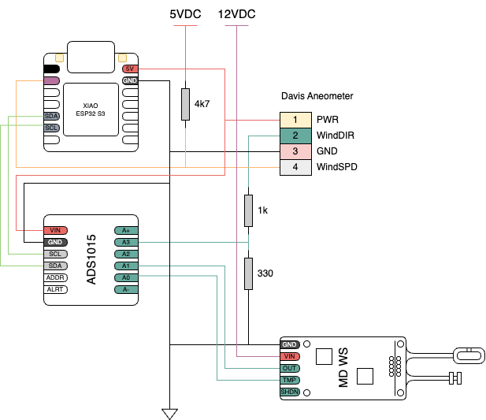

# ESP32 Wetterstation

- [Hardware](#hardware)
- [Features](#features)
- [Installation](#installation)
- [Pinsetting](#pinsetting)

<!--- --------------------------------------------------------------------- -->
## Features

### Webservices

|                |                                |
| -------------- | ------------------------------ |
| ASyncWebserver | http://192.168.1.1/            |
| Update OTA     | http://192.168.1.1/update      |
| JSON Server    | http://192.168.1.1/api/sensors |


### Sky Quality Meter (SQM)

- Istil et al. “Night Sky Photometry with Sky Quality Meter.” (2005).

### Air Quality Index (AQI)

- https://document.airnow.gov/technical-assistance-document-for-the-reporting-of-daily-air-quailty.pdf


### Dewpoint Calculation

- https://en.wikipedia.org/wiki/Dew_point

$$\begin{aligned}
    \gamma (T,\mathrm {RH} ) & = & \ln \left({\frac {\mathrm {RH} }{100}}\right)+{\frac {bT}{c+T}} \\ \\
    T_{\mathrm {d} }         & = & {\frac {c\gamma (T,\mathrm {RH} )}{b-\gamma (T,\mathrm {RH} )}} \\ \\
    b                        & = & 17.625   \\ \\
    c                        & = & 243.04°C \\ \\
\end{aligned}$$

<!--- --------------------------------------------------------------------- -->

## Hardware

### Sensors

#### ADS1015 (i2c)

#### BME680 (i2c)

#### HM330X (i2c)

#### Davis Instruments Wind Sensor 6410 (d0, a3)

Wind speed: Digital interrupt based data collection

Wind direction: 20 k&Omega; potentiometer, 1k&Omega;/0.33k voltage divider at an analog in port

#### Modern Devices Wind Sensor Ref.B (a0, a1)

#### MLX90614 (i2c)

#### RG 11 (digital->interrupt)

#### RS 12 (d1)

#### SCD41 (i2c)

#### TSL2591 (i2c)


<!--- --------------------------------------------------------------------- -->


## Installation

- VSCode
- PlatformIO Plugin

#### Modification:

After installing the libraries change in 

*.pio/build/seeed_xiao_esp32s3/ElegantOTA/src/ElegantOTA.h*

0 to 1

```html
#ifndef ELEGANTOTA_USE_ASYNC_WEBSERVER
    #define ELEGANTOTA_USE_ASYNC_WEBSERVER 1
#endif
```

#### Should be created

```c
/* mysecrets.h */
#ifndef MYSECRETS_H
#define MYSECRETS_H

// WiFi credentials
const char *ssid = "xxx";
const char *password = "xxx";

// HTTP credentials
const char *http_username = "xxx";
const char *http_password = "xxx";

#endif
```

<!--- --------------------------------------------------------------------- -->


## Pinsetting



#### ESP32

<code style="color :#69ADFF">**D0**</code> -> Interrupt input  (Davis Instruments Wind Sensor 6410)

<code style="color :#69ADFF">**D4**</code> -> SDA (I2C)

<code style="color :#69ADFF">**D5**</code> -> SCL (I2C)

#### AD1015

<code style="color :#9ECE6A">**AI0**</code> -> Modern Devices temperature

<code style="color :#9ECE6A">**AI1**</code> -> Modern Devices wind sensor

<code style="color :#9ECE6A">**AI2**</code> -> INA169 current sensor

<code style="color :#9ECE6A">**AI3**</code> -> Davis Instruments wind direction


<!--- --------------------------------------------------------------------- -->
## Sources and impressions
- [Seeedstudio Wiki](https://wiki.seeedstudio.com/xiao_esp32s3_getting_started/)
- [Random Nerd Tutorials](https://randomnerdtutorials.com/)
- [Community PlatformIO](https://community.platformio.org/)
- [ElegantOTA](https://github.com/ayushsharma82/ElegantOTA)
- [ChatGPT](https://chatgpt.com)
- [Cactus.io](http://cactus.io/hookups/weather/anemometer) (offline)
- [INDI Library Weatherradio](https://github.com/indilib/indi-3rdparty/tree/master/indi-duino/devices/Firmwares/weatherradio) :exclamation:

### Special articles
- [Gauge sensors](https://randomnerdtutorials.com/esp32-web-server-gauges/)


